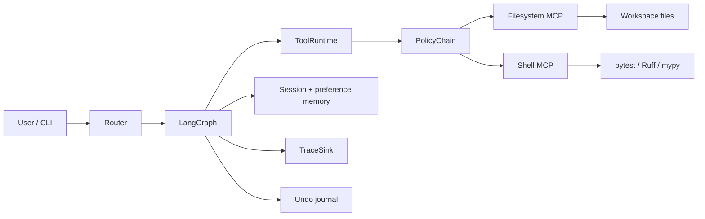
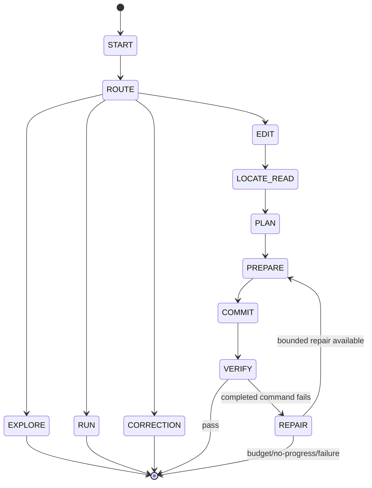

# Coding Agent — Design

## 1. Goals and non-goals

This project is a controlled coding-agent core for a small repository. Its
goals are explicit state-machine orchestration, contextual code understanding,
safe source mutation, reaction to test/lint/type feedback, bounded correction,
memory at relevant scopes, and observable decisions. The important property is
not that a model can call many tools; it is that every consequential step has a
typed boundary, a policy check, and a terminal outcome a reviewer can inspect.

The non-goals are deliberate: arbitrary shell execution, arbitrary autonomous
tool loops, file creation or deletion by the agent, git mutation, redo, vector
search, and broad multi-repository behavior. Those features would expand the
authority and recovery surface without being necessary for the current scope.

## 2. Architecture

The CLI creates one session runtime containing MCP adapters, a
`ToolRuntime`, a model client, an in-memory operation journal, session memory,
a preference store, and a trace sink. The graph receives the runtime as context
and keeps JSON-shaped orchestration state separate from those non-serializable
services. This makes the graph inspectable and keeps provider, filesystem, and
storage concerns outside node logic.

The internal tool interface is semantic: `filesystem.list`,
`filesystem.read`, `filesystem.write`, and `shell.execute`.
`ToolRuntime` resolves a capability, applies the policy chain, invokes the
adapter, validates the result identity, and emits tool trace events. MCP is
therefore an adapter boundary, not the abstraction seen by orchestration code.
A different tool implementation can satisfy the same semantic contract later.

The important runtime boundaries are:

## 3. Orchestration and state machine

LangGraph is used because the workflow benefits from explicit trajectory
boundaries, visible conditional transitions, typed state, failure nodes, and
bounded retry state. It avoids hiding the workflow inside a large autonomous
loop. A model can provide selection or an exact edit plan, but it cannot choose
an arbitrary capability and continue indefinitely.

Routing is deterministic first. High-confidence correction, edit, run, and
explore forms go directly to their graph boundary. Only unresolved intent can
consume one validated `RoutingSelection` model call. An unresolved response
terminates cleanly; it does not guess a tool or command.

The core state flow is intentionally whiteboard-sized:

The full graph has explicit inventory, selection, read, verify, repair, and
terminal nodes. Failure edges are omitted from the diagram for readability,
but each terminal result retains a structured failure code and node.

### Explore

Explore performs a bounded breadth-first inventory. It skips configured
generated directories, caps depth/directories/entries, and validates every
workspace-relative path. A model selects the smallest relevant set from that
inventory; deterministic validation rejects invented, duplicate, directory,
or unsafe paths. Selected files are then read through filesystem MCP within
read and aggregate-context limits. The explanation model receives source as
untrusted evidence and no shell capability is used by this trajectory.

### Run

Run plans a canonical command from a small request map: `pytest`, `ruff check
.`, or `mypy src`. The command is sent as structured argv. A successfully
executed `pytest` with exit code 1 is a `VerificationResult` with
`passed=False`, not a tool failure. By contrast, a subprocess or MCP timeout
is an infrastructure failure and is not repair evidence. Run is
observation-only; automatic repair belongs to Edit.

### Edit

Edit inventories and selects existing files, reads them, and asks for a
structured plan of exact `old_text`/`new_text` replacements. The model does
not write files or emit arbitrary patches. Deterministic preparation checks
path scope, occurrence counts, byte limits, and computes candidate content and a
unified diff. Preflight re-reads every target and compares SHA-256 content
identity before any write. Commit then writes through filesystem MCP and
re-reads each file to verify its after-hash.

## 4. Transactions, feedback, and Undo

The edit transaction preflights all candidates, writes in order, and verifies
each write. If a later write or verification fails, it checks that each already
written file still has the transaction-produced after-hash before restoring the
original content in reverse order. If another actor changed a file, rollback
does not overwrite it and reports a rollback conflict. This is best-effort
transactional behavior over an MCP filesystem, not a native multi-file ACID
transaction.

Edit verification is fail-fast in the configured order: `pytest`, Ruff, then
mypy. A completed command with a non-zero exit produces structured diagnostic
evidence. A repair model may return exact replacements only within the files
selected by the original Edit. The repair commits transactionally, then
verification restarts from the first command. The graph makes this transition
visible rather than hiding it in a retry loop. `max_repair_attempts`, LLM/tool
budgets, and repeated-failure fingerprints bound the loop.

The logical Edit operation is original state to final verified state, even if
intermediate repair mutations occurred. Its `OperationRecord` retains the
verification history and final logical diff; it does not present the initial
attempt as a separate user operation.

Correction uses a session-local bounded `InMemoryOperationJournal`. Before
restoring, it re-reads every file and requires the current hash to equal the
known final hash. It then restores final to original through the same
hash-checked transaction. A human change therefore yields `undo_conflict` and
zero undo writes. There is intentionally no redo and no persistent Undo.

## 5. Tools and safety boundaries

Filesystem MCP exposes list, read, and write operations under one resolved
workspace root. Workspace path policy rejects absolute paths, traversal,
drive-qualified paths, null bytes, and symlink escapes. File reads and writes
are bounded. Existing files and exact replacements are required; the agent
cannot create or delete a path.

Shell MCP accepts structured argv for the approved executable set (`pytest`,
`ruff`, `mypy`, and read-only `git` status/diff forms). It uses exec-style
process creation rather than a shell parser, resolves approved executables
through a trusted environment, contains `cwd` in the workspace, and bounds
arguments, timeout, stdout, and stderr. A timeout is surfaced as a shell
infrastructure error. Repository content, model output, and verification
output are untrusted data; prompt-like text in them cannot add tool authority
or widen edit scope.

Budgets are independent for LLM calls, tool calls, and repair attempts. A
counter is checked before invocation and incremented exactly once for each
attempt. Mutation is not started unless enough tool-call capacity remains for
the transaction's rollback reserve. This turns resource exhaustion into a
terminal, inspectable result instead of a partial autonomous loop.

## 6. Memory and context growth

The system has three general memory tiers plus a specialized journal:

- **Working / HOT:** current request, typed LangGraph state, and current
  filesystem evidence. Temporary source and model payloads are cleared from
  terminal Edit/Explore state.
- **Session / WARM:** bounded structured Explore/Run/Edit/Correction events,
  isolated by session ID. Events retain compact paths, commands, outcomes, and
  verification metadata—not raw source, prompts, model responses, or complete
  command output. Oldest-first event/byte compaction is deterministic.
- **Persistent / WARM:** explicit coding preferences in SQLite with a schema
  version, parameterized SQL, short-lived connections, category retrieval, and
  500-character values/100-record bounds. Only explicit “remember” or
  “from now on” wording is captured. Current requests override preferences,
  and preferences cannot authorize tools, files, commands, or scope.
- **Journal:** reversible source snapshots are kept separately in a bounded
  in-memory operation journal because they are integrity-sensitive recovery
  material, not conversational context.

When context grows, relevant recent metadata and preferences remain warm, old
events are evicted, and source is re-read from the filesystem when needed. The
current filesystem is always authoritative. A vector database was not needed
for this small target and would add an indexing and freshness boundary.
Preference reads fail open with a warning; explicit preference write failures
are surfaced so the user knows persistence did not happen.

## 7. Dry-run and observability

Dry-run performs inventory, selection, read, structured planning, deterministic
preparation, and diff generation. It stops before filesystem write,
verification, repair, journal recording, or a successful Edit operation. This
makes the preview a real non-mutating trajectory rather than a late switch
after a transaction has begun.

`TraceSink` has in-memory and JSONL implementations. Events correlate a
session, user-turn trace ID, trajectory, operation ID where available, and
bounded outcomes/timing. Request, routing, model, tool, verification, repair,
correction, and terminal events are represented. Source content, full prompts,
secrets, and reversible snapshots are excluded or redacted.

## 8. Failure behavior

| Failure | Behavior |
| --- | --- |
| Invalid model path | Reject before read or write |
| Stale edit | Abort preflight; preserve external content |
| Failed tests | Offer bounded structured repair within original scope |
| Shell/MCP timeout | Infrastructure failure; no repair from it |
| Partial write | Reverse compensating rollback when hashes still match |
| Rollback conflict | Stop and report possible partial state; do not overwrite |
| Undo after human edit | `undo_conflict`; zero restore writes |
| Model unavailable | Deterministic capabilities remain usable where possible |
| Budget exhausted | Stop before the next external call |

## 9. Key trade-offs

**Exact replacements over fuzzy patches.** Exact occurrence counts and hashes
make edits auditable and deterministic. The cost is less flexibility for broad
refactors; those can be decomposed into smaller explicit edits.

**Compensating filesystem transactions over native atomicity.** Preflight,
post-verification, and reverse rollback provide useful multi-file safety over
MCP. They cannot provide true ACID semantics when an external actor changes a
file between operations.

**Structured memory over vector memory.** Bounded metadata and relevant
preferences are predictable and easy to inspect for this repository. Very
large histories or repositories would need indexing/retrieval infrastructure.

**Deterministic routing first.** Common requests avoid latency, cost, and model
ambiguity. Less obvious language may need one model fallback or may terminate
unresolved rather than guessing.

**Restricted shell over a general development shell.** Verification-only
execution sharply limits command authority and injection risk. It cannot serve
as a general build, deployment, or arbitrary scripting agent.

## 10. Extensions

The boundaries leave room for additional MCP capabilities, explicit
create/delete operations, a persistent operation journal, richer repository
indexing, more verified commands, human approval gates, and remote trace sinks.
Each would need its own policy, state transitions, budget accounting, and
recovery semantics. None is implied to be implemented here.
