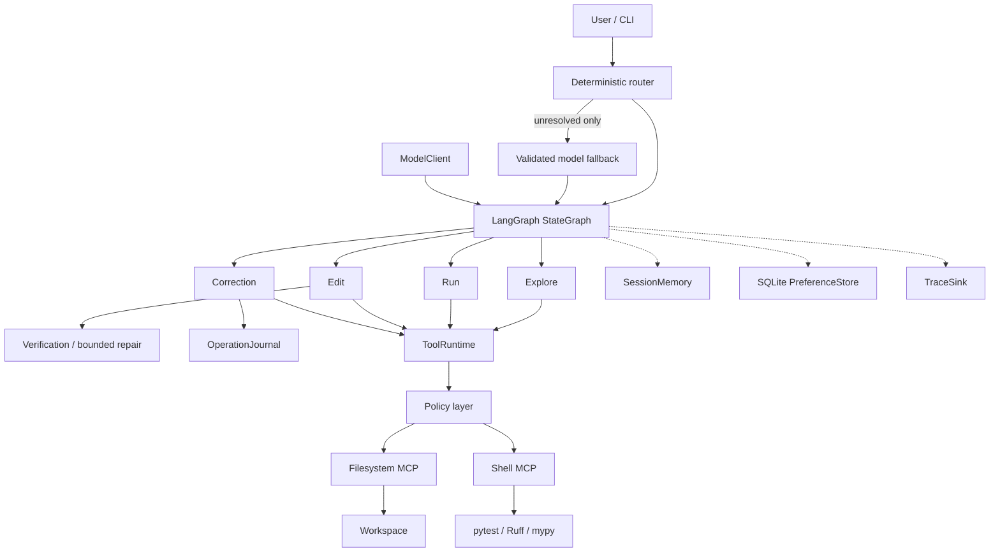

# Coding Agent

A LangGraph-based coding assistant that can explore code, run approved
verification commands, make transactional edits, react to test/lint/type
feedback, and safely undo prior edits. The implementation focuses on
orchestration, bounded memory, feedback loops, safe tool usage, and recoverable
mutation—not on being a general autonomous software engineer.

## What it can do

- **Explore** — breadth-first repository inventory, bounded file selection, and
  grounded explanations from filesystem evidence.
- **Run** — deterministic `pytest`, Ruff, and mypy commands through a secure
  shell boundary. A failing command is reported as verification feedback; it
  is not automatically repaired by the Run trajectory.
- **Edit** — select and read existing files, produce structured exact
  replacements, prepare a bounded diff, commit through the filesystem MCP,
  verify, and perform bounded self-repair when a completed verification
  command fails.
- **Correction** — session-local, hash-checked Undo for the latest reversible
  Edit. Human changes are preserved rather than overwritten.
- **Memory** — typed working state, bounded session outcome history, explicit
  SQLite coding preferences, and a separate in-memory journal for reversible
  snapshots.
- **Product surface** — `chat` and `run` CLI commands, dry-run previews,
  JSONL tracing, and deterministic-first routing with one validated model
  fallback for unresolved intent.

The deliberate limits are equally important: no arbitrary shell execution,
file creation/deletion, git mutation, redo, vector search, or unrestricted
autonomous tool loop.

## Architecture



The agent depends on semantic internal tool capabilities rather than MCP SDK
objects. Policies validate requests before adapters cross the MCP boundary;
the current filesystem remains the source of truth for code.

## Quick start

Requirements: Python 3.11 or 3.12, [uv](https://docs.astral.sh/uv/), and
Node.js with `npx` for the official filesystem MCP integration.

```bash
uv sync
uv run coding-agent health
uv run coding-agent version
```

For Explore, Edit, repair, and ambiguous routing, configure a model:

```bash
export OPENAI_API_KEY="..."
export OPENAI_MODEL="gpt-4.1-mini"   # optional
```

The CLI keeps one session runtime across `chat` turns. Preferences are stored
under `${CODING_AGENT_DATA_DIR:-~/.local/share/coding-agent}`; set
`CODING_AGENT_DATA_DIR` to an application-data directory when needed.

## Demo

The checked-in target at `examples/task_app` is a small standard-library Task
service. Its baseline checks are clean and evaluation tests mutate only
temporary copies.

```bash
uv run coding-agent chat --workspace examples/task_app
uv run coding-agent run "run tests" --workspace examples/task_app
```

An illustrative session is:

```text
> How are tasks created?
> Run the tests
> Add validation to reject empty task titles
> Undo that
```

Preview an Edit without writing, verifying, repairing, journaling, or
committing an operation:

```bash
uv run coding-agent run \
  "Add validation to reject empty task titles" \
  --workspace examples/task_app --dry-run
```

Write bounded execution events to JSONL outside the target workspace:

```bash
uv run coding-agent run "run tests" \
  --workspace examples/task_app \
  --trace-file /tmp/coding-agent-trace.jsonl
```

Deterministic Run and Correction requests work without an API key. Model-backed
requests fail clearly with `model_not_configured` when no key is configured.

## Testing and evaluation

```bash
uv run pytest
uv run pytest -m integration
uv run pytest tests/evaluation -v
uv run ruff check .
uv run ruff format --check .
uv run mypy src
```

The ordinary command excludes the eight tests marked `integration`; the
explicit integration command launches the real local MCP coverage. The
evaluation suite uses deterministic fake models, real filesystem and shell
MCP, ToolRuntime, and LangGraph, so it does not require `OPENAI_API_KEY`.
See [EVALUATION.md](EVALUATION.md) for the scenario map and reviewer commands.

At the time of submission: 223 ordinary tests pass with 8 integration tests
deselected, 8 integration tests pass explicitly, and 21 evaluation tests
pass.

## Safety model

Filesystem paths are workspace-relative and policy-checked. Edit plans can
only target inventoried existing files and use exact text replacements with
expected occurrence counts. SHA-256 hashes protect stale reads, post-write
verification, rollback, and Undo conflicts.

Shell execution uses structured `argv`, approved verification commands,
workspace-contained `cwd`, trusted executable resolution, bounded timeouts,
and bounded stdout/stderr. It never invokes a shell parser or `shell=True`.
Repository content, model output, and verification output are treated as
untrusted evidence rather than instructions.

## Repository map

```text
src/coding_agent/
  orchestration/   LangGraph state machine and trajectories
  tools/           semantic runtime and MCP adapters
  policies/        workspace and shell authorization
  model/           provider protocol and OpenAI client
  memory/          session history and SQLite preferences
  editing.py       exact-replacement transactions and rollback
  observability.py bounded trace sinks and model tracing
examples/task_app/ evaluation target
tests/             unit, MCP integration, and evaluation suites
EVALUATION.md     scenario-level reviewer guide
DESIGN.md         architecture, failure semantics, and trade-offs
```

For design rationale and interview-level architecture detail, read
[DESIGN.md](DESIGN.md).
